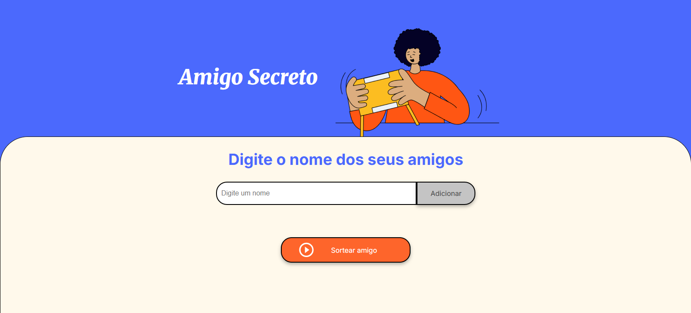

# Sorteador de Amigo Secreto 🎁

Este é um projeto desenvolvido como parte do Challenge de Lógica de Programação da Alura em parceria com a Oracle (Oracle Next Education - ONE). O objetivo é criar uma aplicação web simples que permita aos usuários adicionar nomes de participantes e realizar o sorteio de um Amigo Secreto.

## 🎯 Objetivo do Challenge

O principal objetivo deste desafio é fortalecer e aplicar os conhecimentos em **lógica de programação** com JavaScript, manipulando elementos do DOM e implementando as regras de negócio para o sorteio do amigo secreto.

## 🚀 Deploy

Você pode acessar a versão ao vivo do projeto hospedada na Vercel através do link abaixo:

**[Acessar o projeto Sorteador de Amigo Secreto]()**

## 🚀 Funcionalidades

O projeto, quando finalizado, permitirá:

-   **Adicionar participantes:** Inserir o nome de um amigo e adicioná-lo à lista.
-   **Listar participantes:** Visualizar todos os amigos que já foram adicionados.
-   **Sortear:** Realizar o sorteio para definir quem será presenteado.

## 🛠️ Tecnologias Utilizadas

-   **HTML5:** Para a estrutura da página.
-   **CSS3:** Para a estilização e o design.
-   **JavaScript:** Para a lógica de programação e interatividade.

## 🖼️ Layout da Aplicação

A interface foi projetada para ser simples e intuitiva, com um campo para adicionar nomes e botões para adicionar, sortear e reiniciar.

---
*Projeto desenvolvido durante o programa Oracle Next Education (ONE).*

